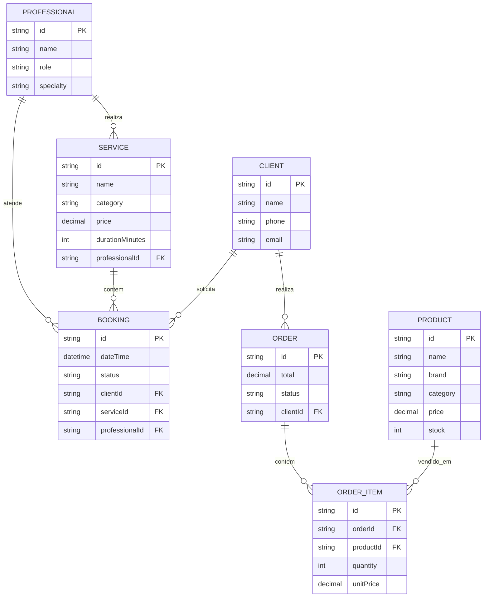
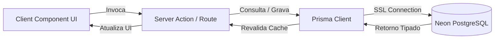

# 💇 Glamour Studio — Arquitetura do Projeto

Aplicação web para o salão **Glamour Studio**, desenvolvida em **Next.js (App Router)** integrada com **Prisma ORM** e banco de dados **PostgreSQL Serverless (Neon)**.

---

## 🏛️ 1. Stack Tecnológica

| Camada | Tecnologia |
| :--- | :--- |
| **Framework** | Next.js 16 (App Router) |
| **Linguagem / UI** | TypeScript, React 19, Tailwind CSS v4 |
| **ORM** | Prisma ORM |
| **Banco de Dados** | Neon (PostgreSQL Serverless) |
| **Deploy** | Vercel |

---

## 📁 2. Estrutura de Diretórios

```text
PROJETO-SAL-O/
├── app/                      # Rotas e páginas (Next.js App Router)
│   ├── agendar/              # Fluxo de agendamento online
│   ├── produtos/             # Vitrine e catálogo de produtos
│   ├── api/                  # Route Handlers (APIs REST se necessário)
│   ├── layout.tsx            # Layout global (Navbar, Footer, Providers)
│   └── page.tsx              # Landing Page principal
│
├── prisma/                   # Configuração e Schemas do Banco
│   ├── schema.prisma         # Definição dos modelos e conexões
│   └── seed.ts               # Dados iniciais (profissionais, serviços, produtos)
│
├── src/
│   ├── components/           # Componentes modulares e reutilizáveis
│   │   ├── booking/          # Componentes do fluxo de agendamento
│   │   ├── cart/             # Drawer/Modal do carrinho de compras
│   │   ├── common/           # Botões, Modais, Cards genéricos
│   │   ├── layout/           # Header, Navbar, Footer
│   │   └── sections/         # Seções da landing page (Hero, Serviços, etc.)
│   ├── context/              # Estados globais (CartContext, BookingContext)
│   ├── data/                 # Interfaces e dados estáticos de fallback
│   ├── lib/                  # Utilitários e instâncias globais
│   │   └── prisma.ts         # Singleton do Prisma Client
│   └── actions/              # Server Actions (mutações diretas no banco)
│       ├── bookingActions.ts # Criar/listar agendamentos
│       └── productActions.ts # Consultas e pedidos
│
├── .env.local                # Variáveis de ambiente (DATABASE_URL)
└── package.json
```

---

## 🗄️ 3. Modelagem de Dados (Prisma Schema)

Principais entidades mapeadas no banco:



---

## ⚙️ 4. Integração Neon + Prisma

### 4.1 Variável de Ambiente (`.env.local`)
No painel do **Neon**, copie a connection string:
```env
DATABASE_URL="postgresql://[USER]:[PASSWORD]@[HOST]/[DATABASE]?sslmode=require"
```

### 4.2 Instalação das Dependências
```bash
npm install @prisma/client
npm install -D prisma
```

### 4.3 Cliente Prisma Singleton (`src/lib/prisma.ts`)
Evita múltiplas conexões abertas durante o Hot Reload em desenvolvimento:
```typescript
import { PrismaClient } from '@prisma/client';

const globalForPrisma = globalThis as unknown as { prisma: PrismaClient };

export const prisma = globalForPrisma.prisma || new PrismaClient();

if (process.env.NODE_ENV !== 'production') globalForPrisma.prisma = prisma;
```

---

## 🚀 5. Fluxo de Dados e Comunicação



1. **Leitura de Dados**: Server Components consultam o `prisma` diretamente no servidor (sem expor credenciais).
2. **Gravação / Ações**: Formulários de agendamento e checkout chamam **Server Actions** (`src/actions/`).
3. **Validação & Persistência**: A Server Action valida os dados e executa `prisma.booking.create(...)`.

---

## 🛠️ 6. Comandos Úteis

| Comando | Descrição |
| :--- | :--- |
| `npx prisma init` | Inicializa o Prisma no projeto |
| `npx prisma db push` | Sincroniza o schema diretamente com o Neon |
| `npx prisma migrate dev` | Cria e aplica migrações versionadas |
| `npx prisma studio` | Abre interface web visual para ver e editar dados |
| `npx prisma generate` | Atualiza os tipos TypeScript do `@prisma/client` |
| `npm run dev` | Inicia o servidor Next.js |

